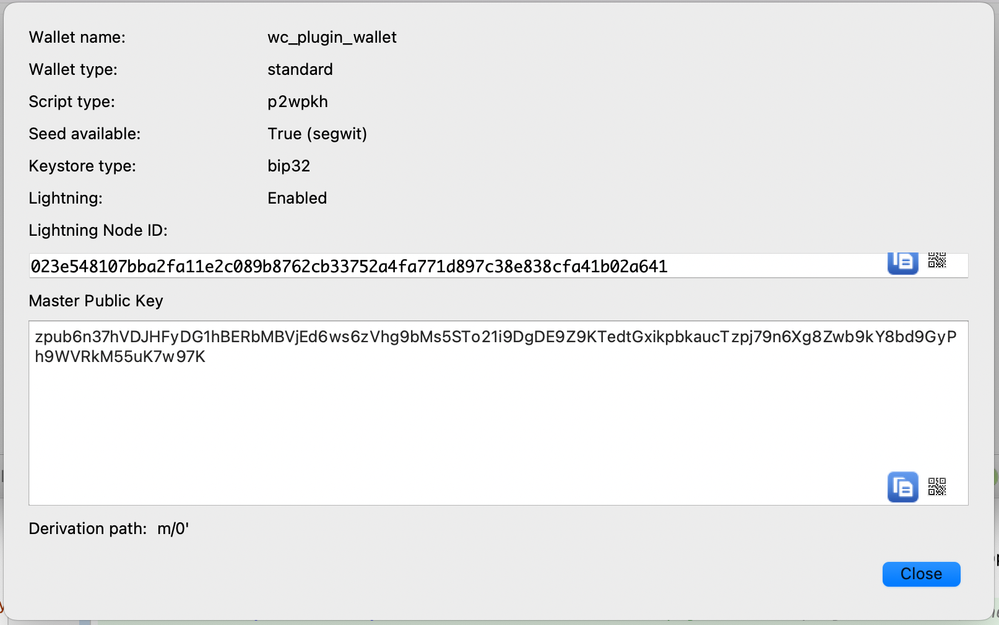
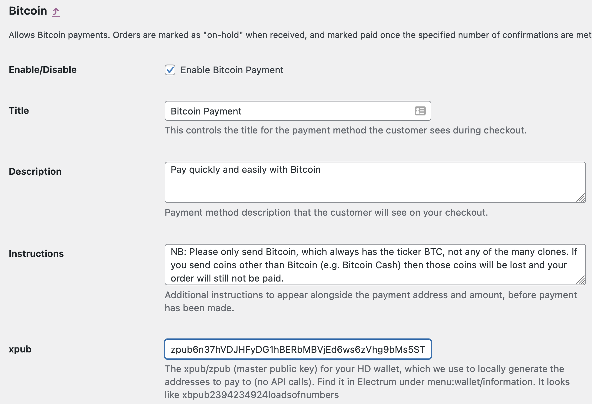
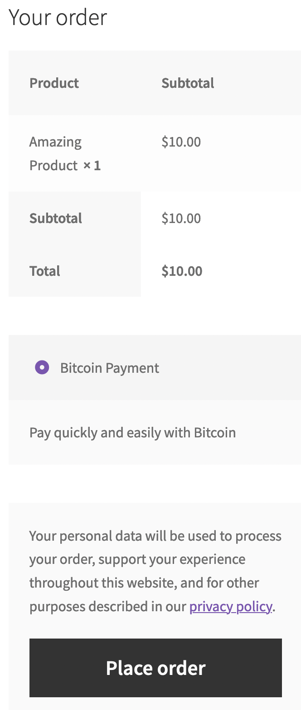

[](https://wordpress.org/plugins/woocommerce-gateway-bitcoin) [](https://github.com/WordPress-Coding-Standards/WordPress-Coding-Standards) [](https://brianhenryie.github.io/woocommerce-gateway-bitcoin/) [](https://github.com/szepeviktor/phpstan-wordpress) 


# WooCommerce Gateway Bitcoin

Self-custody Bitcoin checkout for woocommerce. No middle man, privacy oriented, minimal maintenance, simple.

Get paid directly into your self-custody wallet without any middleman or any [KYC'd](https://en.wikipedia.org/wiki/Know_your_customer) APIs.
No signups, no Terms of Service, nobody taking a cut. Make a sale on your site and it drops straight into
your [Electrum](https://electrum.org/#home) (or whatever) wallet. Payments are between you and the Bitcoin network (well and possibly
the public API providers somewhat but you have a choice which to use).

NO FULL BITCOIN NODE REQUIRED \o/

THIS IS VERY MUCH WIP - MAKE OF IT WHAT YOU WILL. IF YOU MANAGE TO BREAK IT SOMEHOW [PLEASE DO LET ME KNOW](https://github.com/BrianHenryIE/woocommerce-gateway-bitcoin/issues) OR BETTER STILL [FIX IT AND THEN LET ME KNOW](https://github.com/BrianHenryIE/woocommerce-gateway-bitcoin/pulls) :)

- Built with using [Electrum](https://electrum.org/#home) in mind. Love it or hate it it's the on-ramp for many people. Should work with other wallets which also use the m/0/1 derivation path (most of them?), though not currently tested as such

- This is not trying to be fancy and compete with [BTCpayserver](https://btcpayserver.org/). BTCpayserver is an awesome product but the technical
  threshold is still a bit high for some people if you want to run your own, or you need to use a 3rd party service like [BTCPayJungle](https://github.com/BTCPayJungle). If you're wanting to do [Lightning payments](https://en.wikipedia.org/wiki/Lightning_Network) then just go and figure out btcpayserver. But if you just want nobody else taking a slice and don't have your own node then this might be an easy-to-set up and lightweight option. No "accounts" needed with anyone. Just you and your self-custody wallet.

- This plugin uses public APIs which require no [KYC](https://en.wikipedia.org/wiki/Know_your_customer), and self-custody wallets (e.g. [Electrum](https://electrum.org/#home)). You just need your local wallet and your xpub
  and you can start taking payments which land right in your electrum wallet. Boosh.

- Basic principle is that you drop your xpub (master public key, you can find this in electrum/wallet/information, starts
  "xpub*abunchanumbers*") into the plugin settings, from that we use the [bitwasp library](https://github.com/Bit-Wasp/bitcoin-php) to *locally* (on the server) derive Bticoin addresses
  using m/0/n derivation path (like electrum) which means the addresses generated will line up 100% with the addresses
  which show up in your electrum wallet, BUT unlike the [nomiddleman plugin](https://github.com/nomiddleman/nomiddleman-woocommerce) (which was the only other/closest plugin like this I could find), you don't have to "load" addresses in manually one by one, which is a pain in the short term and only gets more annoying with time, especially in a busy shop. So this plugin generates new addresses in the background (via [WooCommerce's Action Scheduler](https://github.com/woocommerce/action-scheduler)) when addresses get low.

- Each address only gets issued once, and once issued is "tied" to the woocommerce order via postmeta, so that the two are linked

- Addresses are pre-generated in batches in the background so there's a list of at least 50 
  sat there in a textfile ready to use, so we don't have to do any heavy maths on the fly, just pop the next address off the "address stack".
  Once issued, that address is removed from the "fresh addresses" stack and pushed onto the "used addresses" stack, ~~along with the corresponding woocommerce order number. That way hopefully even if somehow you lose the postmeta info with the address for the order, you would still have the address use log for reconciling addresses with orders~~.

- Currently this plugin uses [blockchain.info's public api](https://www.blockchain.com/api) to check address balances but will soon also be compatible with [blockstream.info's public api](https://github.com/Blockstream/esplora/blob/master/API.md) which I believe can also be accessed over [tor](https://www.torproject.org/). User will\* be able to set a preference for which to use, but the other will be available as a failover in case the site gets rate-limited by either API.

[NullCorps](https://github.com/Nullcorps)

## Installation 

### Requirements:

This plugin requires the following PHP modules to work. Please note Mcrypt is no longer included as part of the standard PHP modules so needs a little extra work to install, I've included a link to a set of instructions which worked. Replace "7.4" with whatever version of php you're using. I've only tested up to 7.4 currently:

- bcmath   :   `php -m | grep bcmath`   :   sudo apt install php7.4-bcmath
- gmp      :   `php -m | grep gmp`      :  sudo apt install php7.4-gmp
- mcrypt   :   `php -r 'echo function_exists("mcrypt_encrypt") ? "yes" : "no";'`  https://computingforgeeks.com/install-php-mcrypt-extension-on-ubuntu/

### Instructions:

- download the plugin from the [GitHub releases](https://github.com/BrianHenryIE/woocommerce-gateway-bitcoin/releases), log into WordPress, click Plugins in the menu, Add Plugin, upload, activate.


then:
- in the admin dashboard under WooCommerce/Settings/Payments you should now see the payment option listed


- copy and paste in the xpub from your wallet. In electrum it's under menu:wallet/infromation. It should start with xpub and then a bunch of numbers





- save the settings. ~~You may also want to set the 0-conf limit to 0 if you don't want to allow zer-confirmation transactions (probably a good idea)~~ (now the default)

You should now be able to add an item to your cart, head to the checkout and with a bit of luck you'll see the bitcoin payment option. If you proceed with that it should then show you an address, QR-code etc which is now tied to this order and will not be reused. ~~It's ok though, you can generate as many addresses as you like, all you need to do is re-visit that addresses page periodically to top up your stash of addresses. On a super busy site you might want to adjust the settings to pre-generate a larger number of addresses e.g. 200.~~




PLEASE NOTE: segwit wallets doesn't seem to be supported by bitwasp, there's nothing I can really do about that currently. (TODO: double-check this, [it may be possible](https://github.com/Bit-Wasp/bitcoin-php/issues/863) )

## Use

After checkout, this is what the customer will see:


* The QR code can be scanned or clicked, and contains the address and amount.
* "Payment Address" and "Payment Total" are both links which copy the value to the clipboard.
* "Last Checked" is a link which checks the blockchain for transactions.
* A background check runs every five minutes as long as the order remains on-hold.
* The customer can view the same payment instructions under `my-account/orders/123`.

On the admin order UI, the Bitcoin details are visible in a metabox:


Addresses are saved as a custom post type and their status can be seen in a standard WordPress list table:


## TODO (nullcorps)

MOSTLY DONE? - make it also work with blockstream.info's api, allow user to set preference but keep the other as a failover in case of rate limiting
- does the failover work?

~~IN PROG - add a settings field to allow css hacks? or could this be done at the theme customer level. The css id's should be unique so why not?~~
~~- well..whilst not a settings field, been adding ids to buttons etc which then mean you can do "additional css" bits in your theme options.~~

~~IN PROG - idk, tidy it up a bit, remove any inline css~~

~~IN PROG (needs automating now) - auto refill addresses when running low, something like on payme page, self maintaining.~~
~~- this just needs a shortcode or something with a silent version of the [woobtc_addresses] function which gets hit by a cron+wget or a web cron like montastic.com periodically to refill the addresses. Done manually atm when you go to the "check/refill addresses" page. (btw if you don't have one of those pages you need one - just add a blank page ad /addresses and put the [woobtc_addresses] shortcode in it. You'll need to run that page before it'll work)~~

~~DITC - just before fresh address is linked to order in the postmeta, check past/present balances are still 0~~

- install/setup procedure?
    - install plugin
    - enable in woocommerce/settings/payments
    - go into the settings page for btc payments
    - get your xpub from electrum under wallet/information, it starts with xpubandthenalotofnumbers. Other wallet users google "how do i find my xpub [walletname]"
    - paste that in, fill in the settings, should be self explanatory. Main one is re 0-conf transactions. Set to 0 to require confirmations for all transactions or set a price up to which you will accept 0-conf transactions (not really recommended since wiht the current high fees someone could send a tx with 1sat/byte fees and there's a good chance it would get bounced back to them, so waiting for a confirmation is recommended, but the option is there).
    ~~- make a page at /addresses add the shortcode [woobtc_addresses]~~
    ~~- visit that page, it should do a bunch of maths~~
    ~~- refresh that page a few times, it should have a stack of 50 (or however many you set) addresses liksted and have finished scanning/updating and removing used ones~~
    ~~- that should be about it really?~~

- fee checking thing. So given the current fee situation and the threat of lowballing the fee and bouncing a 0-conf tx, perhaps enable 0-conf transactions up to the value specified as long as the fee is above e.g. a fixed value like 15s/b (low tech but easier to implement) or perhaps from some sort of fee estimating thing but it needs to be public api. check blockstream/blockchain.info. That way if the client cheaps out on the fee they have to wait for a confirmation, but honest users who just want it NOW get processed more quickly.

~~- Automate the address refill process like on btcpayme~~
    - add a "non-verbose" option to the [woobtc_addresses] thing which can be called from montastic or cron+wget

* add mbtc as well as sats etc for ppl on default electrum settings (came up in testing)

* figure out wtf's needed to get this into the WP repo once it's at that point

* DONE - ~~added "percentage discount for BTC payment" option (2021-11-02)~~ Removed by @BrianHenryIE, can be achieved with [Payment Gateway Based Fees and Discounts for WooCommerce plugin](https://wordpress.org/plugins/checkout-fees-for-woocommerce/)
* DONE - integrate in SS (test)
* DONE - integrate in FDV
* DONE - integrate in MSL
* DONE - integrate in TG
* DONE - auto prune addresses which may have been used in the mean time (e.g. multiple instances?)
* NOPE - maybe allow user-definable derivation paths? Do other wallets use something other than m/0/1? << HA! How about no(t right now anyway)
* NOPE - give the option of QR from google images or local libary depending on privacy preference << meh, why?

# Considerations:

- depending on how busy your shop is, and the ratio of people who enter the checkout process vs those who complete the checkout process, there
  will be quite a few addresses which remain unused. So say 1/10 people convert, you'll end up with 9 unusued addresses vs 1 used, which means
  electrum might start to "fall behind" with how far ahead it's looking for payments which would then mean you could be receiving payments but
  Electrum isn't checking the addresses that far ahead so you think you've not been paid, when actually you have. The payments are there but
  Electrum's just not checking that far ahead on the addresses list.

In this case you can set the lookahead value (gap limit?) for electrum from the electrum console (tab) by typing the following and your payments
will magically appear:

```
wallet.change_gap_limit(200)
wallet.synchronize()
```

see: https://bitcoin.stackexchange.com/questions/63641/how-to-list-all-the-hd-address-in-electrum


## TODO (BrianHenryIE)

* When the master key changes... flush the cache?
* When the master key changes... generate addresses
* Verify instructions are being sent in emails
* Dependency injection container
* Automatically cancel orders over one day -- with order note "no transactions at address..."
* Show transactions in meta box on order page?

## Contributing

Clone this repo, open in PhpStorm, then run `composer install` to install the dependencies:

```
git clone https://github.com/brianhenryie/woocommerce-gateway-bitcoin.git;
open -a PhpStorm ./;
composer install;
```

For integration and acceptance tests, a local webserver must be running with `localhost:8080/woocommerce-gateway-bitcoin/` pointing at the root of the repo. MariaDB (or MySQL) must also be running locally – with two databases set up with:

```
mysql_username="root"
mysql_password="secret"

# export PATH=${PATH}:/usr/local/mysql/bin

# Make .env available 
# Bash:
export $(grep -v '^#' .env.testing | xargs)
# Zsh:
source .env.testing

# Create the database user:
# MySQL
mysql -u $mysql_username -p$mysql_password -e "CREATE USER '"$TEST_DB_USER"'@'%' IDENTIFIED WITH mysql_native_password BY '"$TEST_DB_PASSWORD"';";
# MariaDB
mysql -u $mysql_username -p$mysql_password -e "CREATE USER '"$TEST_DB_USER"'@'%' IDENTIFIED BY '"$TEST_DB_PASSWORD"';";

# Create the databases:
mysql -u $mysql_username -p$mysql_password -e "CREATE DATABASE "$TEST_SITE_DB_NAME"; USE "$TEST_SITE_DB_NAME"; GRANT ALL PRIVILEGES ON "$TEST_SITE_DB_NAME".* TO '"$TEST_DB_USER"'@'%';";
mysql -u $mysql_username -p$mysql_password -e "CREATE DATABASE "$TEST_DB_NAME"; USE "$TEST_DB_NAME"; GRANT ALL PRIVILEGES ON "$TEST_DB_NAME".* TO '"$TEST_DB_USER"'@'%';";

# Import the WordPress database:
mysql -u $mysql_username -p$mysql_password $TEST_SITE_DB_NAME < tests/_data/dump.sql
```

### WordPress Coding Standards

See documentation on [WordPress.org](https://make.wordpress.org/core/handbook/best-practices/coding-standards/) and [GitHub.com](https://github.com/WordPress/WordPress-Coding-Standards).

Correct errors where possible and list the remaining with:

```
composer lint
```

### Tests

Tests use the [Codeception](https://codeception.com/) add-on [WP-Browser](https://github.com/lucatume/wp-browser) and include vanilla PHPUnit tests with [WP_Mock](https://github.com/10up/wp_mock). 

Run tests with:

```
vendor/bin/codecept run unit;
vendor/bin/codecept run wpunit;
vendor/bin/codecept run integration;
vendor/bin/codecept run acceptance;
```

Show code coverage (unit+wpunit):

```
XDEBUG_MODE=coverage composer run-script coverage-tests 
```

```
vendor/bin/phpstan analyse --memory-limit 1G
```

To save changes made to the acceptance database:

```
export $(grep -v '^#' .env.testing | xargs)
mysqldump -u $TEST_SITE_DB_USER -p$TEST_SITE_DB_PASSWORD $TEST_SITE_DB_NAME > tests/_data/dump.sql
```

To clear Codeception cache after moving/removing test files:

```
vendor/bin/codecept clean
```

### More Information

See [github.com/BrianHenryIE/WordPress-Plugin-Boilerplate](https://github.com/BrianHenryIE/WordPress-Plugin-Boilerplate) for initial setup rationale. 

# Acknowledgements


Big thank you to [@orionwl](https://twitter.com/orionwl) for talking things through along the way and patiently explaining the maths side of it over and over till I get it :)

This uses the [Bitwasp library](https://github.com/Bit-Wasp/bitcoin-php) for all the maths heavy lifting, address generating etc. 

