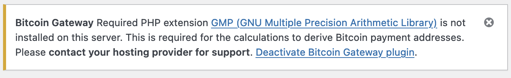

[](https://wordpress.org/plugins/woocommerce-gateway-bitcoin) [](https://github.com/WordPress-Coding-Standards/WordPress-Coding-Standards) [](https://brianhenryie.github.io/bh-wc-bitcoin-gateway/) [](https://github.com/szepeviktor/phpstan-wordpress) 

# Bitcoin Gateway for WooCommerce

Self-custody Bitcoin payment gateway for WooCommerce. Bitcoin is paid directly into your wallet. Transactions are verified using public APIs. No private keys are stored on the server. No account is needed with any third party.

_The WooCommerce Bitcoin  gateway most philosophically aligned with WordPress and Bitcoin._

## Installation and Use

1. Download and install the latest version from [GitHub Releases](https://github.com/BrianHenryIE/woocommerce-gateway-bitcoin/releases/). In the admin dashboard under WooCommerce/Settings/Payments you should now see the payment option listed:


2. From your Bitcoin wallet, copy your "Master Public Key". It should start with `xpub`, `zpub` or `ypub` and then a long alphanumeric string.

<details>
<summary>E.g. Electrum Bitcoin Wallet</summary>

For [Electrum Bitcoin Wallet](https://electrum.org/), it's in the menu under `Wallet`/`Infromation`:


</details>

3. Paste that into the payment gateway settings screen and save:


4. You will now be able to add an item to your cart, head to the checkout and see the Bitcoin payment option.


5. When an order is placed, a derived payment address is tied to this order and will not be reused. After checkout, this is what the customer will see:


* The QR code can be scanned or clicked, and contains the address and amount
* "Payment Address" and "Payment Total" are both links which copy the value to the clipboard
* "Last Checked" is a link which queries the blockchain for new transactions
* A background check runs every five minutes as long as the order remains on-hold
* The customer can view the same payment instructions under `my-account/orders/123`

6. In the WooCommerce admin order UI, the Bitcoin details are visible in a metabox:


7. WooCommerce's Action Scheduler regularly checks unpaid Bitcoin orders' addresses for new transactions, logs those transactions in the order notes, and marks the orders as paid once the expected amount of Bitcoin has been received.

## Notes

### Custom Post Types

Payment addresses are saved as a custom post type and their status can be seen in a standard WordPress list table:


Similarly, wallet addresses (xpubs / master public keys) are saved as a custom post type.

### Templates

All customer and admin UIs can be easily overridden using the standard WooCommerce templating system. 

### PHP Requirements

This plugin uses [Bit-Wasp/bitcoin-php](https://github.com/Bit-Wasp/bitcoin-php) to derive Bitcoin payment addresses on your server. This requires PHP's BC Math, Mcrypt and GMP extensions. The former two are provided by polyfill libraries, [phpseclib/bcmath_compat](https://github.com/phpseclib/bcmath_compat) and [phpseclib/mcrypt_compat](https://github.com/phpseclib/mcrypt_compat). If the [GMP extension](https://www.php.net/manual/en/book.gmp.php) is not installed on your server, the gateway will not be added to WooCommerce and an admin notice will be displayed explaining why.



### APIs

Exchange rate:

* [Bitfinex](https://www.bitfinex.com/) - [API](https://docs.bitfinex.com/docs) - default
* [BitStamp](https://www.bitstamp.net/) - [API](https://www.bitstamp.net/api/) - implemented but not in use

Transactions:

* [SoChain](https://www.sochain.com/) - [API](https://sochain.com/api/) - default
* [Blockchain.com](https://blockchain.com) - [API](https://www.blockchain.com/api) - implemented but not in use
* [Blockstream.info](https://blockstream.info/) - [API](https://github.com/Blockstream/esplora/blob/master/API.md) - implemented but not in use

### Syncing received payments with wallets

Wallets only check a set number of derived addresses for payments and orders may be assigned an address outside the list your wallet is checking. If your store reports a payment has been received, you may need to configure your wallet to look at more addresses.

<details>
<summary>E.g. Electrum Bitcoin Wallet</summary>

In the case of Electrum, in the menu choose `View`/`Show Console`, visit the `Console` tab, and set the lookahead value by typing the following:
```
wallet.change_gap_limit(200)
wallet.synchronize()
```
See: https://bitcoin.stackexchange.com/questions/63641/how-to-list-all-the-hd-address-in-electrum

</details>

## TODO

### <= v2.0

* ~~Fix hard-coded log level (respect settings)~~
* ~~WooCommerce Blocks checkout~~
* Unpaid order expiry
* 100% WPCS and PhpStan
* Update screenshots + use mobile view for customer screenshots
* Webpack build in GitHub Actions

### v2.0+

* Show transactions in meta box on order page
* GitHub Actions for E2E tests
* Zero-conf payments for virtual products (mempool). To avoid the threat of fraud where the fee is low-balled, only accept zero-conf transactions whose fees are above recent expected range
* Run contract tests to find what currencies are supported by the Exchange_Rate APIs
* Remove 'required' setting on checkout billing fields
* API round-robin and failover
* Partial payment email
* Tor
* Units: Add mbtc as well as sats etc. (to match default Electrum display settings)

## How You Can Help

Please contribute:

* Directions and screenshots showing how to find master public key (xpub) in various wallets
* Directions on enabling PHP GMP extension – even just notes on which hosts enabled it when requested or refused the request.
* Bug reports
* Feature requests, particularly UX related
* Code review
* Pull requests: read the [composer.json](https://github.com/BrianHenryIE/bh-wc-bitcoin-gateway/blob/master/composer.json) and see [BrianHenryIE/WordPress-Plugin-Boilerplate](https://github.com/BrianHenryIE/WordPress-Plugin-Boilerplate) to understand developer setup 

## Motivation and Alternatives 

The previous Bitcoin gateway I used was initially chosen because payments were made directly to a custodial wallet. The company behind it eventually stopped supporting that and only offered the option of a hosted wallet. I also realised after using it for a while that when an order was made, the entire order contents – products, customer address etc. – were being sent to the company's API when the payment address was being generated by them. Totally unnecessary and definitely not GDPR compliant.

Most existing solutions (see [WordPress.org plugin repo](https://wordpress.org/plugins/search/Bitcoin/)) suffer from one of the following:

* **Non-custodial wallet**. Funds are sent to a wallet managed by another company, which carries the risk of you losing funds due to their security incidents (unfortunately not uncommon), and gives them full view of your financial transactions.
* **Sign-up required**. Many plugins are written to encourage the use of a particular API and this often requires signing up for an account with a third party who should be unconnected to your financial transactions.
* **Profit motivated**. The purpose is often to upsell merchants to currency exchange services, or to charge a transaction fee for the use of the "free" plugin. 

I would like to acknowledge plugins similar to this one, who do not have any of those flaws:

* Sovereign Crypto Payments _by OnionBazaar_ – [WordPress.org](https://wordpress.org/plugins/sovereign-crypto-payments/) | [GitHub](https://github.com/onionbazaar/sovereign-crypto-payments)
* Nomiddleman Bitcoin and Crypto Payments for WooCommerce – [WordPress.org](https://wordpress.org/plugins/nomiddleman-crypto-payments-for-woocommerce/) | [GitHub](https://github.com/nomiddleman/nomiddleman-woocommerce/)
* Accept Bitcoin _by Bitonymous_ – [WordPress.org](https://wordpress.org/plugins/accept-bitcoin)

WooCommerce are themselves (officially) encouraging the use of crypto (see [It’s Time to Start Accepting Cryptocurrency](https://woocommerce.com/posts/start-accepting-cryptocurrency/), woocommerce.com, 2022-11-02) but the [plugins listed on their site](https://woocommerce.com/cryptocurrency/) are all by venture-capital backed companies.

To use one of those plugins is to eschew Bitcoin's fundamental quality of being a peer-to-peer network.

They are also contrary to WordPress's "open" philosophy. Using this plugin does not preclude you from using the services of any company, and it does not restrict or commit you to any company.

Original development started by [NullCorps](https://github.com/Nullcorps) pre September 2020. BrianHenryIE forked and began using v1.x in March 2022. What helped prompt v2.0 was [Bob Dunn](https://bobwp.com)'s podcast episodes:

* [WooCommerce, Payments and Crypto with Keala Gaines and Dave Lockie](https://dothewoo.io/woocommerce-payments-and-crypto/), Doo the Woo, 2023-01-10
* [Accepting Cryptocurrency in a WooCommerce Store with Lauren Dowling](https://dothewoo.io/cryptocurrency-woocommerce-store/), Doo the Woo, 2023-01-17

# Acknowledgements

This plugin is forked from [Nullcorps/woocommerce-gateway-bitcoin](https://github.com/Nullcorps/woocommerce-gateway-bitcoin) who figured out all the core functionality, i.e. the address generation, exchange rates, payment confirmations – everything Bitcoin related. The work here has been to implement that as a modern WordPress/WooCommerce plugin with Action Scheduler, CPTs, Composer, automated tests, WPCS, etc. Thank you, [NullCorps](https://github.com/Nullcorps)!

> I think this stuff below is correct, but idk.
>
> It's free, go nuts. I'm just sticking things together to make stuff.
>
> – _Nullcorps_

Big thank you to [@orionwl](https://twitter.com/orionwl) for talking things through along the way and patiently explaining the maths side of it over and over till I get it :) – _Nullcorps_
